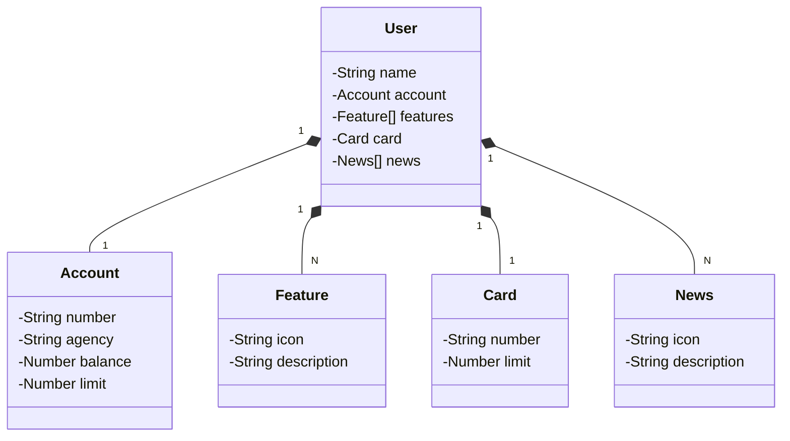

# Dio - Bootcamp Java Cloud Native
## Feature: API REST Bancária na Nuvem Usando Spring Boot 3, Java 21 e Railway

Repositório do Projeto implementação do projeto API REST Bancária na Nuvem Usando Spring Boot 3, Java 21 e Railway do curso "Publicando Sua API REST na Nuvem Usando Spring Boot 3, Java 17 e Railway".
- Diagrama de Classes do Projeto

cantuario2 - 29/03/2025
### Rev. 00
